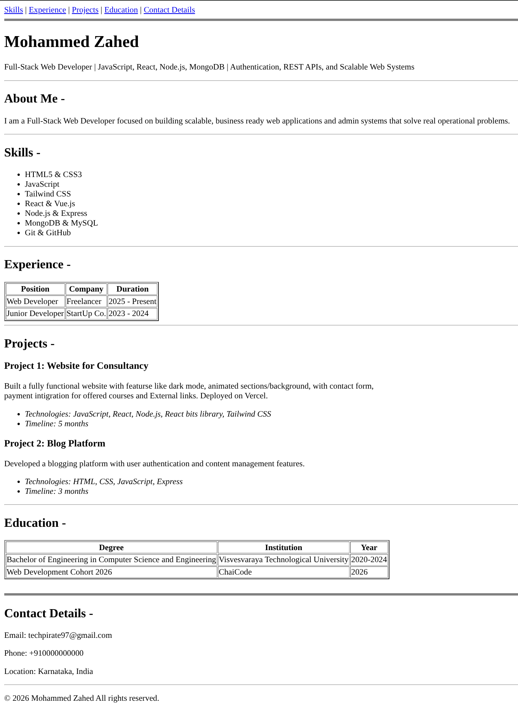

# portfolio-html

This is a single page portfolio website built using pure HTML.

## Features
- About Me section
- Skills list
- Experience table
- Projects overview
- Education details
- Contact information
- Internal navigation using anchor links

## Technologies Used
- HTML5

## Setup Instructions
1. Download or clone this repository
2. Open the `index.html` file in any modern web browser

## Usage
- Use the navigation links to jump between sections
- Scroll through the page to view profile, skills, projects, and contact details

## Screenshots

## Live Demo
(Add GitHub Pages or deployed link here if available)
